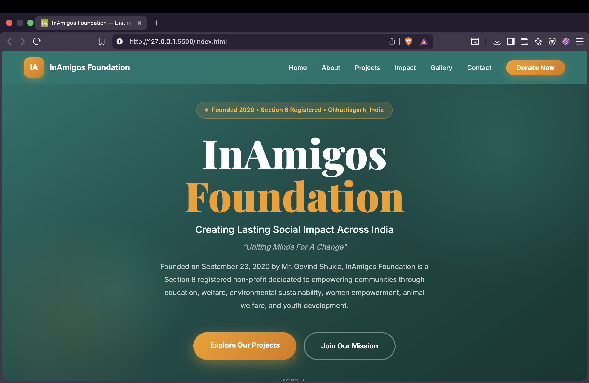

# TASK1: NGO AWARENESS WEBPAGE CREATION

Objective - Create a webpage to spread awareness about our NGO projects and initiatives.

A static, responsive website for **InAmigos Foundation**, a Section 8 registered non-profit organisation based in Chhattisgarh, India, founded on September 23, 2020 by Mr. Govind Shukla.

🌐 Official site: [inamigosfoundation.org.in](https://inamigosfoundation.org.in)

---

## 📸 Screenshot

<div align="center">

</div>

---

## 📖 About

InAmigos Foundation works across India to create sustainable social impact through community-driven initiatives covering education, welfare, environmental sustainability, women empowerment, animal welfare, and youth development.

This repository contains the source code for the foundation's official marketing/informational website — built as a single-page site with smooth-scroll navigation to each section.

---

## 🛠️ Tech Stack

- **HTML5** — semantic markup, single page (`index.html`)
- **CSS3** — custom properties (CSS variables), CSS Grid & Flexbox, no framework
- **Google Fonts** — Playfair Display (headings) + Inter (body)
- No build tools, no dependencies, no JavaScript framework — pure static site

---

## 📁 Project Structure

```
TASK1/
├── favicon/
│   ├── android-chrome-192x192.png
│   ├── android-chrome-512x512.png
│   ├── apple-touch-icon.png
│   ├── favicon-16x16.png
│   ├── favicon-32x32.png
│   ├── favicon.ico
│   ├── site.webmanifest
│   └── about.txt
├── images/
│   ├── animal_welfare.jpg
│   ├── children_education.jpg
│   ├── Food_distribution.jpg
│   ├── tree_plantation.jpg
│   ├── volunteers.jpg
│   └── women_empowerment.jpg
├── index.html
├── style.css
├── README.md
```

---

## 🧩 Sections

| Section         | Description                                                             |
| --------------- | ----------------------------------------------------------------------- |
| **Home / Hero** | Mission tagline, founding info, CTA buttons                             |
| **About**       | Organisation background, mission, certifications                        |
| **Projects**    | Six core initiatives — Seva, Bachpanshala, Jeev, Udaan, Prakriti, Vikas |
| **Impact**      | Why-it-matters cards + key stats (meals, saplings, interns, etc.)       |
| **Journey**     | Timeline of milestones from 2020–2025                                   |
| **Gallery**     | Photo grid of on-ground activities                                      |
| **Contact**     | Volunteer sign-up (Google Form) + email + social links                  |

---

## 🚀 Running Locally

No build step required — it's static HTML/CSS.

1. Clone the repo:
   ```bash
   git clone https://github.com/soham-kyo/InAmigos_Internship_Tasks.git
   cd TASK1
   ```
2. Open `index.html` directly in a browser, **or** serve it locally to avoid any relative-path quirks:

   ```bash
   # Python 3
   python -m http.server 5500
   ```

   Then visit `http://localhost:5500`.

   If you use VS Code, the **Live Server** extension (or "Go Live", visible in your status bar) works too.

---

## ✏️ Updating Content

- **Text/copy** — edit directly in `index.html`; content is plain semantic HTML, no templating.
- **Colors/fonts/spacing** — controlled via CSS custom properties at the top of `style.css` (`:root` block) — change `--teal`, `--amber`, etc. to re-theme site-wide.
- **Images** — drop replacements into `/images` keeping the same filenames, or update `src` attributes in `index.html` if renaming.
- **Stats/numbers** — appear in two places: the `proj-impact` spans (per-project) and the `stats-band` section — keep both in sync if updating impact figures.

---

## 📬 Contact

- **Website:** [inamigosfoundation.org.in](https://inamigosfoundation.org.in)
- **Email:** support@inamigosfoundation.org.in
- **Founder & CEO:** Mr. Govind Shukla — [LinkedIn](https://www.linkedin.com/in/govind-shukla-7500631a0/)
- **Instagram:** [@inamigos](https://www.instagram.com/inamigos/)
- **X (Twitter):** [@InamigosF](https://x.com/InamigosF)
- **LinkedIn (org):** [InAmigos Foundation](https://in.linkedin.com/company/inamigos-foundation)
- **YouTube:** [@inamigosfoundation](https://www.youtube.com/@inamigosfoundation)

---

_Made for a better India 🇮🇳 — InAmigos Foundation_
_Made by Soham Patil_
